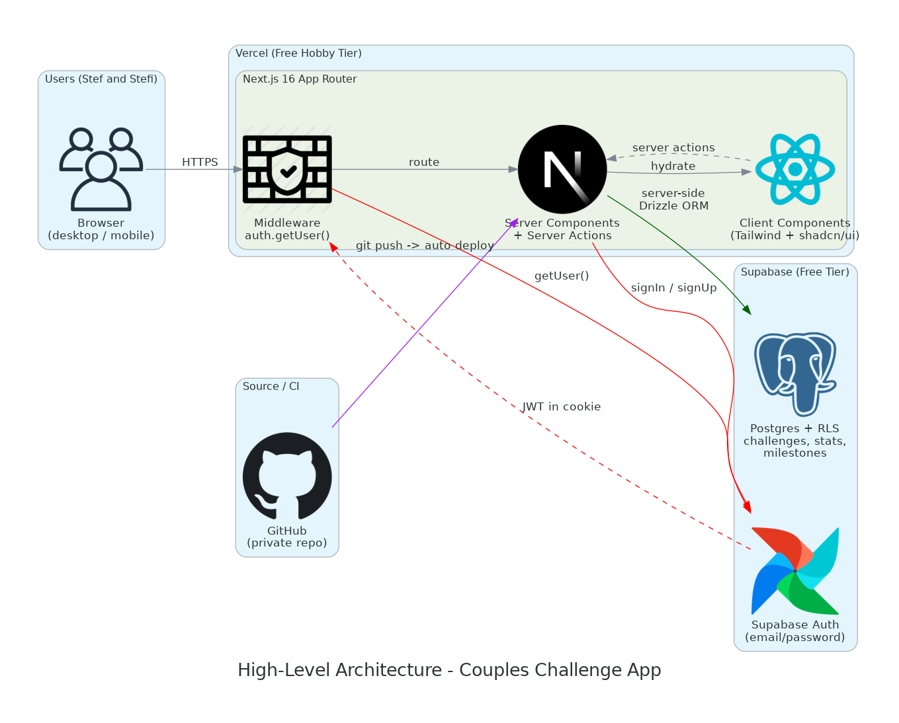
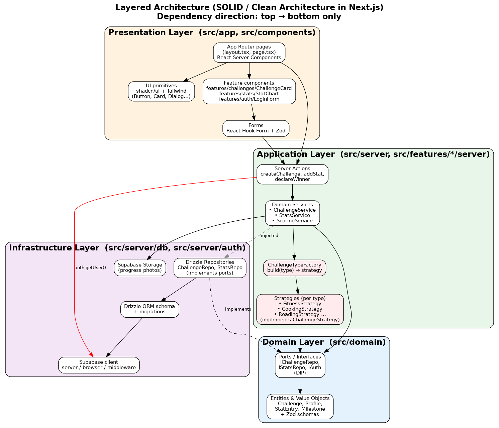
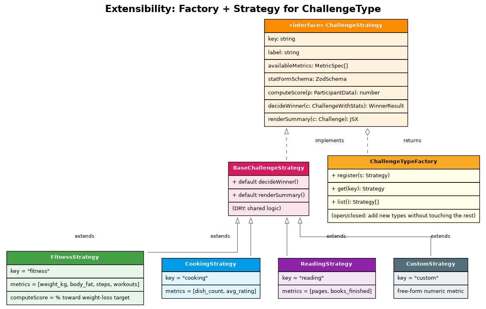
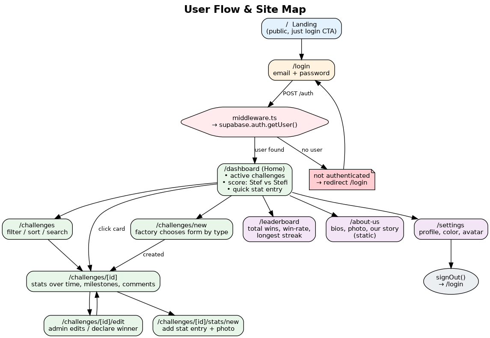
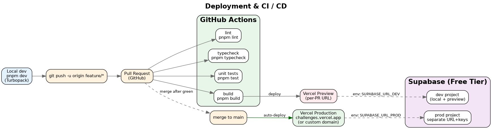

# 03 — Architecture

## High-level architecture



A request from your phone goes:

1. **Browser** → HTTPS → Vercel edge.
2. **Next.js middleware** runs on every request. It calls `supabase.auth.getUser()`
   (which actually validates the JWT against Supabase Auth servers — `getSession()`
   would be unsafe). If there's no user, it redirects to `/login`. If there is, it
   refreshes the cookie if needed and lets the request through.
3. **Server Component** for the route runs. It uses an authenticated Supabase
   server client + Drizzle to fetch only the rows the user is allowed to see — and
   *Postgres RLS* enforces this even if our query has a bug.
4. The HTML streams back to the browser.
5. Client components hydrate (forms, charts, etc.).
6. Mutations go through **Server Actions**, which re-validate the user, run Zod
   on the input, hit the Drizzle repository, then `revalidatePath` so the RSC
   re-renders.

## Layered architecture (Clean Architecture, adapted to Next.js)



We split the codebase into four conceptual layers. Dependencies flow **only
downward** — UI knows about services, services know about ports, ports know about
domain types. The infrastructure layer is the only thing that knows about
Supabase or Drizzle, and it does so by *implementing* an interface declared in
the domain layer (DIP).

```
src/
  app/                          # Next.js App Router. Pages, layouts, route handlers.
  components/                   # UI primitives (shadcn) + cross-cutting components.
    ui/                         # shadcn-generated: Button, Card, Dialog…
  features/                     # Vertical slices, one folder per domain area.
    challenges/
      components/               # ChallengeCard, ChallengeForm, …  (presentation)
      strategies/               # FitnessStrategy.ts, CookingStrategy.ts, … (Strategy)
      factory.ts                # ChallengeTypeFactory (Factory)
      schemas.ts                # Zod schemas (input + output)
      service.ts                # ChallengeService (application/domain)
      actions.ts                # 'use server' — Next.js Server Actions
      repo.ts                   # Drizzle queries (infrastructure)
    stats/        ...
    auth/         ...
    profiles/     ...
  domain/                       # Pure TypeScript: entities, value objects, ports.
    entities.ts
    ports.ts                    # IChallengeRepo, IStatsRepo, IAuth
  server/
    db/
      schema.ts                 # Drizzle schema (single source of truth)
      client.ts                 # Drizzle client (server-only)
      migrations/
    auth/
      server.ts                 # createServerClient (cookies)
      browser.ts                # createBrowserClient
      middleware.ts             # createMiddlewareClient
  hooks/                        # Client-only hooks (useDebounce, useTheme…)
  # (no stores/ in v1 — re-add when global client state is justified)
  lib/                          # Pure utilities (formatDate, cn, …)
  styles/
  middleware.ts                 # Next.js middleware (auth gate)
```

**Rules of thumb:**

- `app/` and `components/` and `features/*/components/` may import from `features/*/{actions,schemas}` and `lib/`. They must not import directly from `server/` or `repo.ts`.
- `actions.ts` calls `service.ts`. `service.ts` depends on a repository **interface** (port) and gets the concrete implementation injected.
- The Drizzle repository (in `repo.ts`) is the only place that knows about SQL/Drizzle.
- The Supabase server client is only created inside server code — never imported into a client component.

## Authentication & authorisation (defence in depth)

We check identity at **three layers**:

1. **Middleware** — first gate, redirects unauthenticated users to `/login`.
2. **Page / Server Action** — re-checks `getUser()` before reading or writing data
   (the WorkOS / Supabase guidance: *never trust middleware alone*).
3. **Postgres Row-Level Security** — the database itself rejects rows that don't
   belong to the calling user. Even a buggy query can't leak data.

Public sign-up is **disabled** in Supabase. Your two accounts are seeded once via
SQL or the Supabase dashboard. Anyone hitting the site without a session sees the
`/login` page and that's it — no `/signup` route exists.

## Request flow — concrete example

User visits `/dashboard`:

```
GET /dashboard
  → middleware.ts: getUser() → user OK, refresh cookie
  → app/(authed)/dashboard/page.tsx (RSC)
      → service.listActiveChallenges(userId)
          → repo.findActive(userId)         // Drizzle query
              → Postgres                      // RLS filters to user's rows
          → Strategy.computeScore() per challenge   // Factory + Strategy
      → render <DashboardCards data={...} />
  → HTML streams to client
  → <StatQuickAdd> hydrates as a client component
```

User submits the quick-stat form:

```
form action -> server action stats/actions.ts addStatEntry(formData)
  → 'use server'
  → getUser() — re-verify
  → Zod parse
  → service.addStat(...)
      → repo.insertStat(...)        // Postgres + RLS
  → revalidatePath('/dashboard')    // RSC re-renders
  → return { ok: true }
```

## Extensibility: how a new challenge type is added

To add a "Reading" challenge type, the *only* changes are:

1. Create `src/features/challenges/strategies/reading.ts` implementing
   `ChallengeStrategy` (key, label, metrics, `computeScore`, `decideWinner`).
2. Register it in `src/features/challenges/factory.ts` (one line).
3. Insert a row into the seed `challenge_types` table.

No DB migration, no UI changes. The challenge-create form picks up the new type
automatically because it iterates over `ChallengeTypeFactory.list()` and the
strategy provides its own Zod schema for the stat-entry form.



## User flow & sitemap



Routes:

- `/` — public landing → "Log in".
- `/login` — public.
- Everything below is gated by middleware:
  - `/dashboard` — overview.
  - `/challenges`, `/challenges/[id]`, `/challenges/new`, `/challenges/[id]/edit`,
    `/challenges/[id]/stats/new`.
  - `/leaderboard`.
  - `/about-us` — static TSX page.
  - `/settings`.
- `/api/health` — 200 OK; pinged externally to keep Supabase awake.

## Deployment & CI/CD



- Push a feature branch → Vercel builds a **preview** URL.
- GitHub Actions runs **lint, typecheck, unit tests, build** in parallel on every PR.
- Merge to `main` → Vercel builds **production**.
- **One Supabase project** for two humans is plenty. Local dev, previews, and
  production all hit the same DB. Trade-off: a destructive action in a preview
  affects real data. Mitigation: the seed script is idempotent and we ship a
  `pnpm seed:reset` that wipes and re-seeds *only* the lookup tables. Day this
  starts to bite, split into `dev` and `prod` projects (10 minutes; the env-var
  names already exist).
- Secrets stored in Vercel Project Settings (URL + keys for Supabase). The repo never contains real keys; `.env.local` is `.gitignore`d.

## Observability (lightweight)

For a 2-user app we don't need Datadog. We just want to know when something is broken:

- **Vercel** logs server actions and RSC errors out of the box.
- **Supabase** logs every auth + DB error.
- A tiny client error boundary posts to a `/api/log-error` route → console (visible in Vercel logs).
- For paranoia backups: Supabase Studio's "Database → Backups" tab exports on demand.
