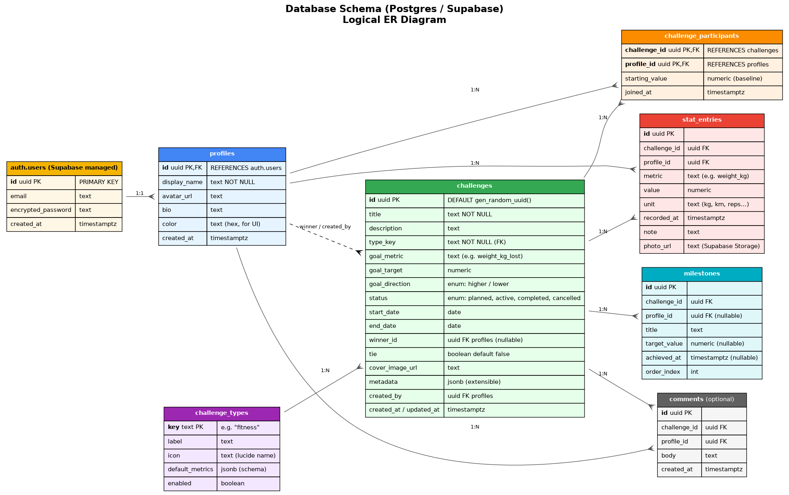

# 04 — Database Schema



The database lives in Postgres (managed by Supabase). The schema is owned by
**Drizzle** in `src/server/db/schema.ts`. Migrations are generated with
`drizzle-kit generate` and applied with `drizzle-kit migrate` (or via the
Supabase SQL editor for the very first apply).

## Tables

### `auth.users` (Supabase-managed, do not touch)

Supabase creates this; we treat it as opaque and only reference its `id`.

### `profiles`

Application-level user data, 1:1 with `auth.users`.

| Column | Type | Notes |
|---|---|---|
| `id` | `uuid` PK | Same value as `auth.users.id`; FK to it. |
| `display_name` | `text` NOT NULL | "Stef", "Stefi". |
| `avatar_url` | `text` | Optional. |
| `bio` | `text` | Optional, shown on About Us. |
| `color` | `text` (hex) | Per-user accent colour, used in charts and badges. |
| `created_at` | `timestamptz` DEFAULT `now()` | |

### `challenge_types`

Seed table for the Factory: lets us add new types without code-only changes.

| Column | Type | Notes |
|---|---|---|
| `key` | `text` PK | e.g. `"fitness"`, `"cooking"`. Matches a strategy in code. |
| `label` | `text` | Display name. |
| `icon` | `text` | Lucide icon name. |
| `default_metrics` | `jsonb` | `{ "schema_version": 1, "metrics": [ { metric: "weight_kg", unit: "kg", direction: "lower" } ] }` |
| `enabled` | `boolean` DEFAULT `true` | Hide/show in the type picker. |

### `challenges`

| Column | Type | Notes |
|---|---|---|
| `id` | `uuid` PK DEFAULT `gen_random_uuid()` | |
| `title` | `text` NOT NULL | "Spring fitness contest". |
| `description` | `text` | Long-form. |
| `type_key` | `text` FK → `challenge_types.key` | |
| `goal_metric` | `text` | The headline metric (e.g. `weight_kg_lost`). |
| `goal_target` | `numeric` | E.g. `5` (kg). |
| `goal_direction` | `text` CHECK IN (`'higher'`,`'lower'`) | |
| `status` | `text` CHECK IN (`'planned'`,`'active'`,`'completed'`,`'cancelled'`) | |
| `start_date` | `date` | |
| `end_date` | `date` | |
| `winner_id` | `uuid` FK → `profiles.id` NULL | NULL until declared. |
| `tie` | `boolean` DEFAULT `false` | |
| `cover_image_url` | `text` | Optional, from Supabase Storage. |
| `metadata` | `jsonb` DEFAULT `'{"schema_version":1}'` | Strategy-specific extras (e.g. `{ "rule": "lowest %BF wins" }`). The `schema_version` field is mandatory — it lets us migrate JSONB shapes without breaking old rows. |
| `created_by` | `uuid` FK → `profiles.id` | |
| `created_at`, `updated_at` | `timestamptz` | |

CHECK constraints: `end_date >= start_date` (a challenge can't end before it
begins). `winner_id` must be NULL unless `status = 'completed'` (or `tie = true`).

Indexes: `(status, end_date)`, `(type_key)`.

### `challenge_participants`

| Column | Type | Notes |
|---|---|---|
| `challenge_id` | `uuid` FK → `challenges.id` | PK part 1 |
| `profile_id` | `uuid` FK → `profiles.id` | PK part 2 |
| `starting_value` | `numeric` | Baseline measurement (e.g. starting weight). |
| `joined_at` | `timestamptz` DEFAULT `now()` | |

PK: `(challenge_id, profile_id)`. Index: `(profile_id)`.

### `stat_entries`

| Column | Type | Notes |
|---|---|---|
| `id` | `uuid` PK | |
| `challenge_id` | `uuid` FK | |
| `profile_id` | `uuid` FK | |
| `metric` | `text` | E.g. `"weight_kg"`. |
| `value` | `numeric` | |
| `unit` | `text` | `"kg"`, `"reps"`, `"km"`, … |
| `recorded_at` | `timestamptz` DEFAULT `now()` | |
| `note` | `text` | |
| `photo_url` | `text` | Optional. |

Indexes: `(challenge_id, recorded_at)`, `(profile_id, recorded_at)`.

### `milestones`

| Column | Type | Notes |
|---|---|---|
| `id` | `uuid` PK | |
| `challenge_id` | `uuid` FK | |
| `profile_id` | `uuid` FK NULL | NULL = "anyone hitting this milestone". |
| `title` | `text` | "First 2 kg lost". |
| `target_value` | `numeric` NULL | |
| `achieved_at` | `timestamptz` NULL | NULL while pending. |
| `order_index` | `int` | Manual ordering. |

### `comments`

**Cut from v1.** When you actually want it, add the table + RLS + UI in one go.
The schema would mirror the others: `id, challenge_id, profile_id, body, created_at`,
RLS on `is_participant(challenge_id)`.

## Why JSONB on `challenges.metadata` and `challenge_types.default_metrics`?

To stay extensible without a migration for every new challenge type. Strongly-typed
columns hold the fields *every* challenge has; everything strategy-specific (e.g. a
cooking challenge wants `{ "judges": [...] }`) lives in `metadata`. The Strategy
class in code defines the JSON shape and validates it with Zod.

## Row-Level Security (RLS)

RLS is **on by default for every table** (Supabase enforces this for tables
created through the dashboard). Without policies the table is unreadable, which
is the safe default.

The two-user model lets us write very simple policies. The principle: a row is
readable/writable iff the caller is one of the participants.

```sql
-- Helper: is the caller a participant of this challenge?
-- NOTE: `security definer` makes this function bypass RLS on its own table
-- (`challenge_participants`) when called. That's intentional — it's how we
-- avoid a circular dependency. Keep the function tightly scoped and never
-- expose it to client code.
create or replace function is_participant(p_challenge uuid)
returns boolean language sql stable security definer as $$
  select exists (
    select 1 from challenge_participants
    where challenge_id = p_challenge
      and profile_id = auth.uid()
  );
$$;

-- Helper: do I share any challenge with this profile? Used to gate `profiles` reads
-- so a stranger (if signups ever leak) cannot enumerate the two of us.
create or replace function shares_challenge_with(p_profile uuid)
returns boolean language sql stable security definer as $$
  select exists (
    select 1
    from challenge_participants a
    join challenge_participants b on a.challenge_id = b.challenge_id
    where a.profile_id = auth.uid()
      and b.profile_id = p_profile
  );
$$;

-- profiles: read your own, plus people who share a challenge with you.
-- (No more `using (true)` — even if signups got re-enabled by accident,
--  a stranger cannot read either of our profiles.)
alter table profiles enable row level security;
create policy "profiles read self or shared"
  on profiles for select
  using (id = auth.uid() or shares_challenge_with(id));
create policy "profiles edit own"
  on profiles for update using (id = auth.uid()) with check (id = auth.uid());

-- challenges: visible if you're a participant or the creator.
alter table challenges enable row level security;
create policy "challenges read"
  on challenges for select
  using (created_by = auth.uid() or is_participant(id));
create policy "challenges insert"
  on challenges for insert
  with check (created_by = auth.uid());
create policy "challenges update"
  on challenges for update
  using (created_by = auth.uid() or is_participant(id))
  with check (created_by = auth.uid() or is_participant(id));
create policy "challenges delete"
  on challenges for delete
  using (created_by = auth.uid());

-- challenge_participants
-- NOTE: insert policy must avoid the chicken-and-egg where is_participant(...)
-- is false until the row exists. We allow inserts if (a) you're inserting
-- yourself, or (b) you're the creator of the challenge bootstrapping it.
alter table challenge_participants enable row level security;
create policy "participants read"
  on challenge_participants for select using (is_participant(challenge_id));
create policy "participants insert"
  on challenge_participants for insert
  with check (
    profile_id = auth.uid()
    or exists (select 1 from challenges c where c.id = challenge_id and c.created_by = auth.uid())
  );
create policy "participants delete own"
  on challenge_participants for delete using (profile_id = auth.uid()
    or exists (select 1 from challenges c where c.id = challenge_id and c.created_by = auth.uid()));

-- stat_entries
alter table stat_entries enable row level security;
create policy "stats read"
  on stat_entries for select using (is_participant(challenge_id));
create policy "stats insert own"
  on stat_entries for insert
  with check (profile_id = auth.uid() and is_participant(challenge_id));
create policy "stats update own"
  on stat_entries for update using (profile_id = auth.uid()) with check (profile_id = auth.uid());
create policy "stats delete own"
  on stat_entries for delete using (profile_id = auth.uid());

-- milestones
alter table milestones enable row level security;
create policy "milestones read"  on milestones for select using (is_participant(challenge_id));
create policy "milestones write" on milestones for all using (is_participant(challenge_id))
  with check (is_participant(challenge_id));

-- challenge_types is a tiny lookup; readable by everyone authenticated.
alter table challenge_types enable row level security;
create policy "types read" on challenge_types for select using (auth.uid() is not null);
```

### Storage bucket policies (`stat-photos`)

Supabase Storage has its own RLS on `storage.objects`. Without explicit policies
the bucket either denies everything (private bucket default) or is wide open
(public bucket). We want a **private** bucket with policies that mirror the table
RLS:

```sql
insert into storage.buckets (id, name, public) values ('stat-photos','stat-photos', false)
on conflict (id) do nothing;

-- Path convention: stat-photos/<challenge_id>/<profile_id>/<file>.jpg
create policy "stat photos read" on storage.objects for select
  using (bucket_id = 'stat-photos'
    and is_participant((storage.foldername(name))[1]::uuid));

create policy "stat photos insert own" on storage.objects for insert
  with check (bucket_id = 'stat-photos'
    and (storage.foldername(name))[2]::uuid = auth.uid()
    and is_participant((storage.foldername(name))[1]::uuid));

create policy "stat photos delete own" on storage.objects for delete
  using (bucket_id = 'stat-photos'
    and (storage.foldername(name))[2]::uuid = auth.uid());
```

**Important:** every column referenced in an RLS policy gets an index — Supabase
docs cite missing RLS indexes as the #1 perf killer. Our schema indexes
`profile_id` and `challenge_id` on every fact table.

## Seed data

In v1 we only ship **Fitness**. Other types are added later (one row + one
strategy file per type).

```sql
insert into challenge_types (key,label,icon,default_metrics) values
  ('fitness','Fitness','dumbbell',
   '{"schema_version":1,"metrics":[
     {"metric":"weight_kg","unit":"kg","direction":"lower"},
     {"metric":"body_fat_pct","unit":"%","direction":"lower"},
     {"metric":"workouts","unit":"count","direction":"higher"},
     {"metric":"steps","unit":"steps","direction":"higher"}]}'::jsonb);
```

When you later add Cooking / Reading / Steps / Custom, append rows in the same
shape — no schema migration needed.

Two profile rows (one per user) are created automatically by a Postgres trigger
when `auth.users` gets a row, so signing in for the first time also creates
the profile. Migration ships that trigger.

## Backups

- Supabase Free tier: nightly backup, kept 7 days.
- For ad-hoc dumps: Supabase Studio → Database → Backups, or `supabase db dump`
  via the CLI. We do **not** ship a custom dump script in v1.
